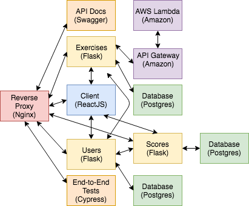

# testdriven-app

A application to learning the build, test, and deploy microservices powered by Docker, Flask, and React.

## Purpose

The objective this project is build quickly spin up a reproducible development environment with Docker to manage a number of microservices.

Once the app is up and running locally, it will be deploy it to an Amazon EC2 instance. Finally, it will be analise scaling the services on Amazon Elastic Container Service (ECS) and adding AWS Lambda.

## APP

## Tools and Technologies

- Python
- Flask
- Docker
- Postgres
- Node and NPM
- React
- Cypress
- Swagger
- Amazon Web Services (AWS)

## Concepts

- Microservice Architecture
- Test-Driven Development (TDD)
- Continuous Integration (CI)
- Continuous Delivery (CD)
- Code Coverage
- Code Quality
- Token-based Authentication
- Containerization
- Container Orchestration
- Serverless Architecture

## LINCESE

